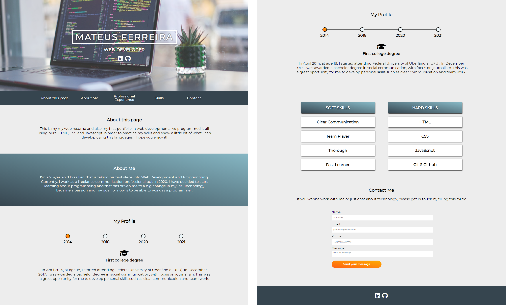

# Interative Personal Website

# About this project 

This is a front-end template for a personal website entirely developed with pure HTML, CSS and JavaScript. It also can be used as a web resume.

# Motivation 

This project is my first portfolio in web development. I've chosen to use no frameworks in order to practice my skills with pure CSS and JavaScript. I'll be extremely happy to receive feedback and suggestions. 

# Tools and Funcionalities  

* A sticky horizontal navbar with links to the page's sections. 
* An interactive timeline with a progressbar programmed with JavaScript. 
* A section for skills with flex display.
* A contact form. 

## Contact Me 

#### Mateus Ferreira
Email: mateusaugustosferreira@hotmail.com
Phone: +55 11 99290-4502

